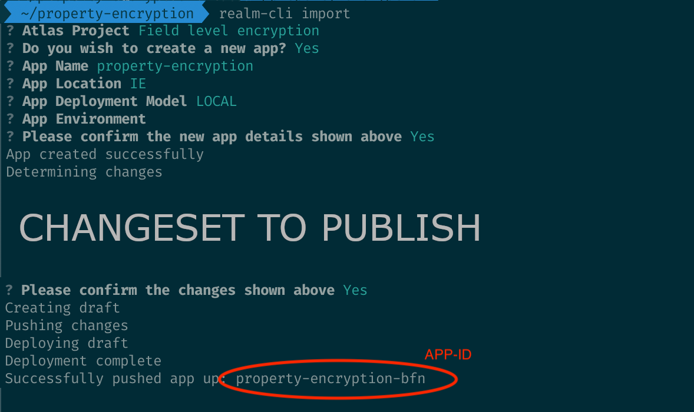

# App Services Usage Samples

Reference app that show cases different design patterns and examples of using the Realm Kotlin SDK with Atlas App Services.

## Samples

### [Property level encryption and offline mode](apps/property-encryption/README.md)

This demo shows the process of protecting users' sensitive data by employing end-to-end encryption techniques while guaranteeing access from any user's device.

Additionally, this demo supports offline mode. Users would have always access to the local data after logging in.

### [Presence detection](apps/presence-detection/README.md)

This sample demonstrates user presence detection with App Services.

### [Client reset and error handling](apps/error-handling/README.md)

A showcase for the different client reset resolution strategies with an sync error handling example.

### [Modelling unstructured data](apps/dynamic-data/README.md)

A showcase for storing and synchronizing unstructured data through collections in mixed properties.

## Demo app structure

The project has been structured in two main folders:

- `demo` - Android app containing the different samples. Samples have been separated in different packages.
- `apps` - Atlas App services apps required by each sample.

## Getting started

The demos are indendepent of each other, which means that it is not required to install all the app services app samples to test an individual sample.

To get started, locate the App services app sources in `apps` that you wish to install. We have conveniently linked them in the Samples list of this document.

Next, follow the "Before you begin" steps outlined in the [Atlas documentation](https://www.mongodb.com/docs/atlas/app-services/apps/create/) to setup an Atlas account and `realm-cli` (See the "App Services CLI" tab). Skip the app creation steps, but create and import the app with the following commands:

```bash
# If not created, create a cluster in Atlas. See https://www.mongodb.com/basics/clusters/mongodb-cluster-setup#creating-a-mongodb-cluster

# If not logged in, log in first
realm-cli login --api-key <your new public key> --private-api-key <your new private key>

# Move to the app directory
cd app/[APP-NAME]

# Import the current app directory
realm-cli import 
```

The `realm-cli import` command will prompt for the app configuration details, the default parameters should be suitable for most cases. Then the tool will publish the app and return the app-id for the newly created app. Example:



After deploying the Atlas apps, you will need to update [Constants.kt](demo/src/main/java/io/realm/appservicesusagesamples/Constants.kt) with their app ids.

Once you have completed these steps, you would be able to run the samples using the Kotlin demo app.
