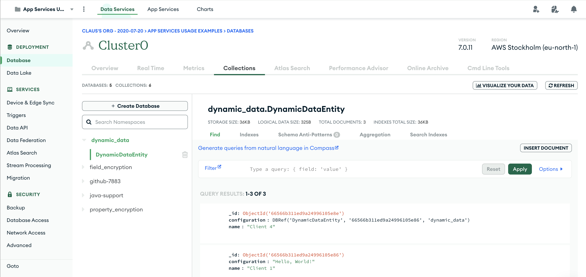

# Dynamic data

With the newly added ability to store collections in mixed properties, you can now store and synchronized 
data without pre-known schema. 

This app just holds a single data class that mixes strictly typed properties and a single mixed property
that will be used as an entry point for the potentially deeply nested, dynamic data. 

The Kotlin UI shows each entity and associated 'configuration' mixed property in a tree view. There is 
currently no update options in the UI, so data has to be added through the Atlas UI in the 
"Data Service" section:

Updates will be reflected in the Kotlin UI. 
