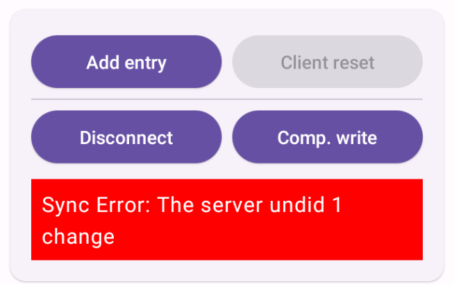
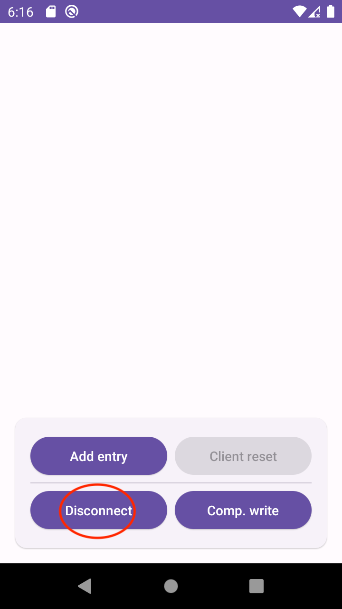
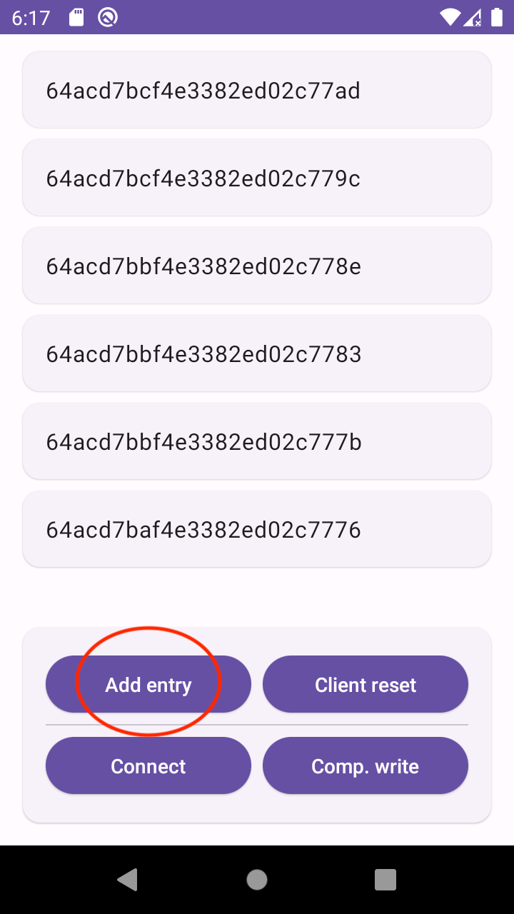
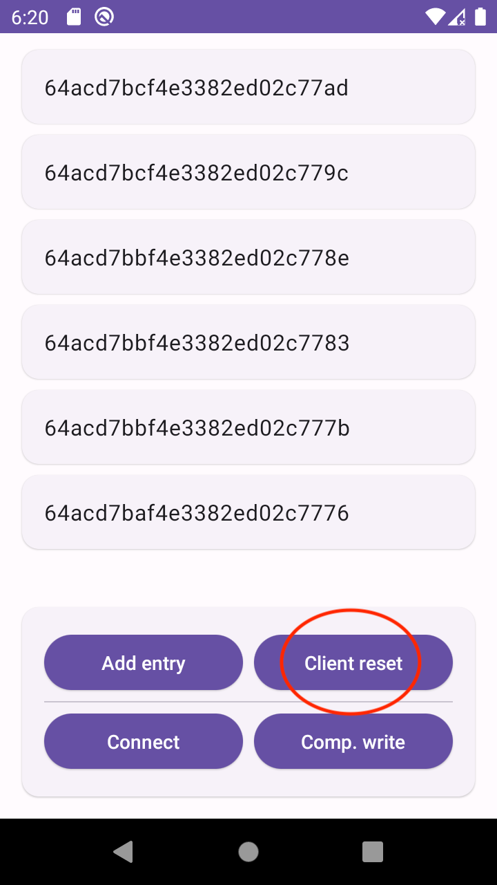
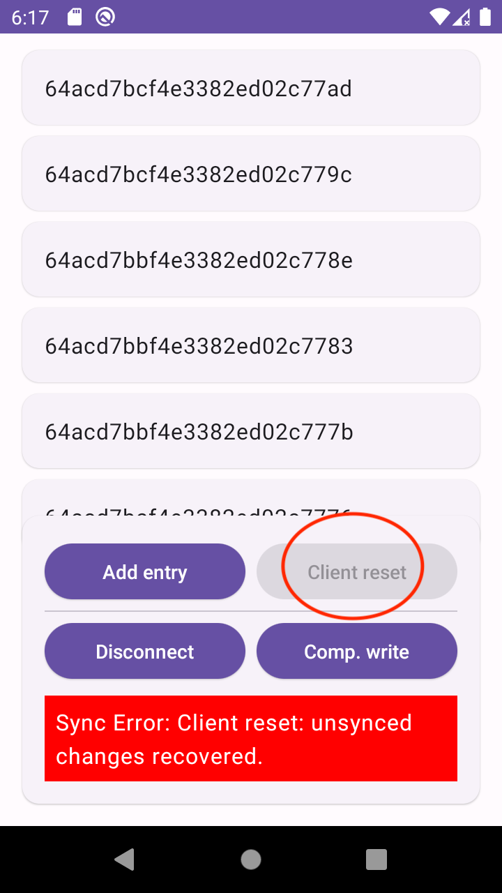

# Client reset and error handling
This sample aims to demonstrate how to handle synchronization errors in Realm. In this demo we will link sync errors to the user UI, and would show case the different client reset strategies available.

## Error handling
Sync errors handling is centralized in a single callback function that can be defined in the Realm configuration. The callback would be invoked on each single exception that occurs and it is up to the user to react or not to it. 

Sync would automatically recover its regular functionality from most of the errors. In some other cases the exceptions might be fatal and would require some user interaction.

The demo allows to trigger compensating write errors, whenever the `Comp. write` button is clicked an entry with wrong permissions is added into the database. The server would detect such incongruency and would dictate to the client to throw a `CompensatingWriteException`. The information about the compensating write would be processed and displayed to the user. We would display other exception messages directly with no processing.

## Client reset
The server would reset the client whenever there is discrepancy that cannot be resolved. By the default, Realm would try to recover any unsynced changes from the client while resetting. However, there are other strategies available, we could discard the changes, do a manual recovery or a backup.

A menu would open just after taping on the button for opening this demo, prompting to select a strategy to evaluate. Once selected, you will be taken to the demo.

To trigger a client reset, first you would need to disconnect from the server. Tap the `Disconnect` button.

Then add serveral entries by tapping the `Add entry` button. Doing this would add data to the local realm, because the app would be be disconnected it wont be synced with the sever.

Now, tap on `Client reset` button, it tell the server to reset this client. After this, the app will reconnect automatically and the client reset would take action.

After the client reset a confirmation message would be displayed and the data would be resetted with the selected strategy.

