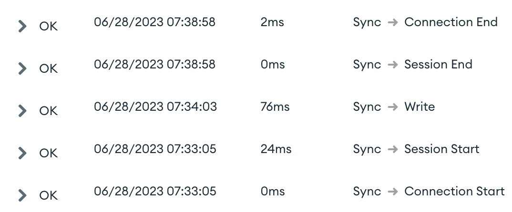
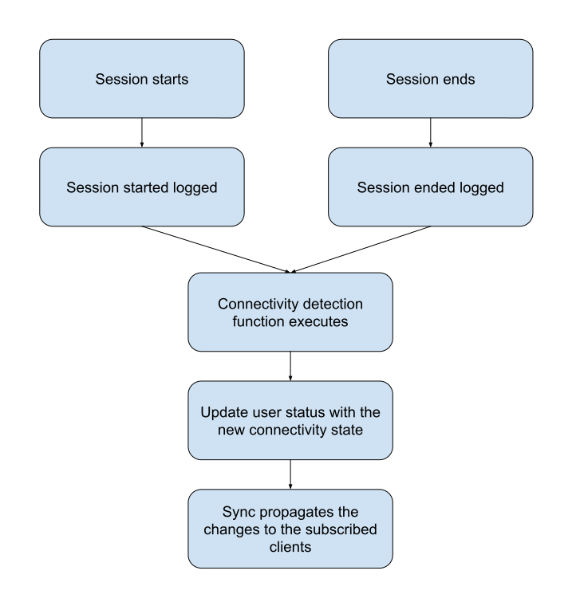

# Presence detection

User presence detection allows to check for connectivity or activity of users or devices. It has many
applications from showing users' availability in a chat application to identify malfunctioning devices in an industrial process.

This sample shows how to implement user presence detection effectively using Realm and Atlas resources.

## Tracking local connectivity

Clients could detect whether they are connected to Atlas via the `SyncSession.connectionState` 
property. The values of the connection state are `DISCONNECTED`, `CONNECTING`, or `CONNECTED`.

Realm supports listening to updates to the connection state via the function `connectionStateAsFlow`, and simplifies listening to 
connectivity changes to:

```kotlin
realm.syncSession
    .connectionStateAsFlow()
    .collect {connectionStateChange ->
        // handle connection state
    }
```

In this sample we use local connectivity detection to change the behavior of the connectivity control
button, it would disconnect or connect the session based on whether there is or not connectivity.

## Tracking connectivity of external devices

There are different approaches on how we can propagate to other parties the connectivity status of a 
client.

### Forwarding logs

This approach exclusively use App services resources to perform the detection exclusively on the server.

App services would log any user connectivity change in the logs as a `Sync` type event. App services support forwarding these logs to predefined functions.



In this sample we have configured a forward log that forward all `Sync` events to a [function](functions/logPresenceDetector.js) that detects connectivity changes. This function analyzes each log to detect if a user has started/ended a session, then it upserts the changes in a [collection](data_sources/mongodb-atlas/presence-detection/user_status/schema.json) that tracks the connectivity for that user.

This collection is part of a Sync Realm, so any changes to it would be automatically propagated all its subscriptions.



The response time for this solution is up to a minute, that is what it takes to the log forwarding feature to post any new updates. Logs can be processed individually or in batches, while it does not affect the response time, doing it in batches debounces changes and eliminates redundant notification changes.

### Alternatives

Another solution that we have not covered in this sample is the clients actively notifying if they have connectivity. 

The clients would send a heart beat to the server each X seconds, then the server could poll for the clients that have not send a beat in Y amount of time, deeming them as disconnected.

While this approach would improve the response time, it would use more resources and wouldn't scale as well.
