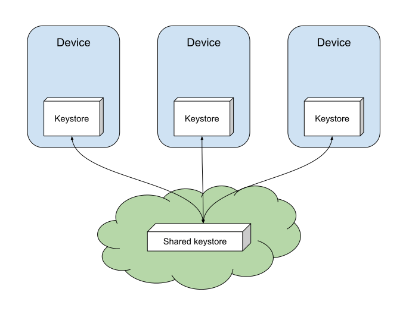
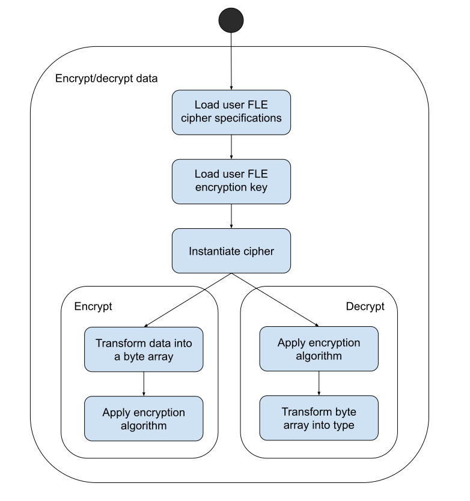
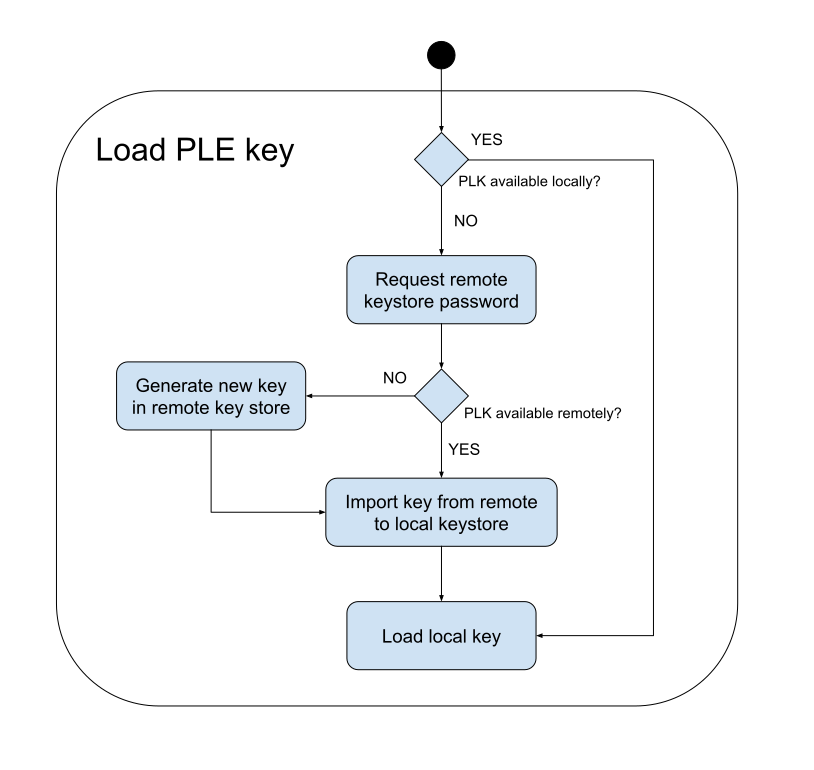

# Property level encryption
The goal of property-level encryption is to ensure that only the users themselves can access their data and prevent any unauthorized access by other parties, including MongoDB. 

Realm does not have built-in property-level encryption support. However, with this sample we will demonstrate how to add this feature with the Realm Sync and Android Keystore APIs. Furthermore, this solution would enable users to access their data simultaneously from multiple devices. All of this is achieved by leveraging the powerful capabilities of MongoDB services.

## Introduction
Property-level encryption restricts access to sensitive data by applying a ciphering algorithm with a unique key that will encrypt the data on the device. The encrypted data will be synced to Atlas, thus only allowing people with the proper key to be able to read it again. This also includes MonogDB itself.

It is crucial to ensure that only the rightful users have access to the keys.

## Considerations
The purpose of this demo is to show how can we leverage MongoDB and other tools to provide end-to-end property-level encryption to users with multi-device access.

There are different algorithms available to achieve encryption, the ones selected in this sample are for demonstrative purposes. Any production development must select them based on their security requirements. 

## Key handling
Keys are stored in a key store on the device, a secure repository that safe-keeps the keys and guarantees that only the rightful users have access to them. It normally has some hardware-enhanced security features.

For this demo, we will use the Android Keystore available from SDK version > 18. It offers hardware-enhanced security like biometric authentication and guarantees that the cryptographic material stored in it is not exportable.

We will use the symmetric encryption algorithm AES, as it provides great performance when encrypting files and data.

## Multi-device support
As we mentioned, the local device keystore does not support exporting keys, this means that a user would not be able to access their data from a new device as the encryption keys would only be available from the original one. To overcome this we need a shared keystore that would allow accessing these keys from any device. 



For this sample, we store the user keys in a password-protected Keystore in the user's `CustomData`. This allows you to control access to these (encrypted) keys based on the permission system in App Services.

We have chosen `BKS` as the remote keystore format as it supports storing symmetric keys. It is also supported by the Android SDK and allows us to show the interaction between the remote and local keystores in the sample code.

## Key import
After the user logs in on a new device, we need to import any required keys from the remote keystore into the local. If no key were available in the remote keystore, we would generate a new one that will be stored both remotely and locally.



This process would ensure that the data is accessible anytime anywhere, even offline as the keys would be stored in the user's devices. While password protected in the server, the keys stored in the device keystore would be hardware protected.

The process of importing the keys can be found [here](../../demo/src/main/java/io/realm/appservicesusagesamples/propertyencryption/ui/keystore/KeyStoreViewModel.kt#L86).

## Encrypting data
As we mentioned before, to be able to encrypt data we need an algorithm along with the key to encrypt and decrypt. In the `CustomData` we have included a property that contains the specification for the algorithm that would be used for PLE.

AES cipher specification is defined in the users custom data.
```json
{
  ple_cipher_spec: {
    algorithm: "AES",
    block: "CBC",
    padding: "PKCS7Padding",
    key_length: 128
  }
}
```

Java Crypto APIs work with binary data, before encrypting we would have to convert the value into a byte array, and then after decrypting we would convert the byte array into the actual type. 

Realm has support for ByteArrays so we would be able to store any encrypted data in a RealmObject. 

```kotlin
class Person: RealmObject {
    var securedContent: ByteArray? = null
}
```

These operations can be encapsulated into a helper delegate, for example [SecureStringDelegate](../../demo/src/main/java/io/realm/appservicesusagesamples/propertyencryption/models/SecureStringDelegate.kt#L45) to seamlessly provide access to the data.

```kotlin
class Person: RealmObject {
    var securedContent: ByteArray? = null
    var content String by SecureStringDelegate(::securedContent)
}
```

Currently, there are some limitations on how we can associate a key to an object or property because RealmObjects don't provide any information about its source realm or user yet. In this demo we have opted for storing such data in global variables.



## Vectors attacks
Nothing is 100% secure, there is always a tradeoffs associated with security. The implementation outlined here also suffers from the vulnerabilities. Please evaluate them against your security needs before using the approach outlined:

The remote keystore stored on the server is only password protected and thus prone to brute-force attacks if anyone gets access to it. Choosing a secure password is very important.
During the import phase, the keys reside in unprotected user memory. Android apps are operating in secure sandboxes, but if a device is rooted this guarantee might be broken and memory will be susceptible to be read by malicious programs.
