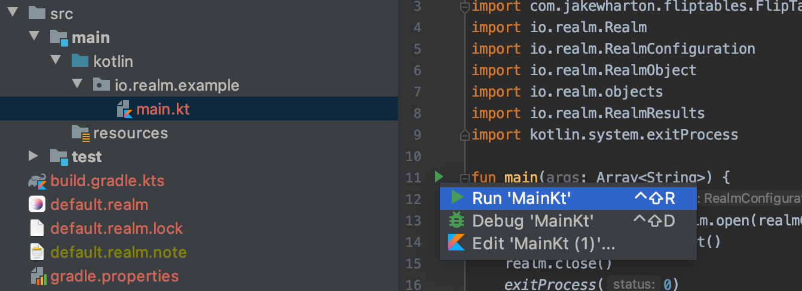

# Simple Java Console Application using Realm-Kotlin.


This application demonstrates the usage of Realm Kotlin SDK in a regular console app (no Multiplatform).
It is powered by Kotlin/JVM support from Realm-Kotlin SDK.

## Run from IntelliJ IDEA

Navigate to `src/main/kotlin/io.realm/example/main.kt`
Click on `Run MainKt` 


## Standalone jar

```Gradle
./gradlew clean jar
java -jar build/libs/JVM_Console-1.0.0.jar
```

