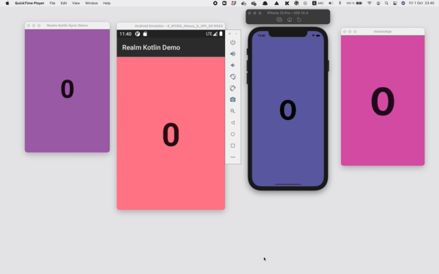

## Kotlin Multiplatform Sync demo App using a shared business logic:

The demo demonstrates [Device Sync](https://www.mongodb.com/atlas/app-services/device-sync) 
running between an Android, iOS, macOS and JVM app.



# Steps to build:

## 1 - Create an Atlas Account and Deploy a Free Cluster

- Follow the steps in the [Get Started with Atlas tutorial](https://www.mongodb.com/docs/atlas/getting-started/) up until (and including) **Create a database user for your cluster**.
- Or watch the [YouTube screencast](https://www.youtube.com/watch?v=lqo0Yf7lnyg).

## 2 - Create an Atlas App Services App

- Follow the [Create an App with the App Services UI guide](https://www.mongodb.com/docs/atlas/app-services/manage-apps/create/create-with-ui/#std-label-create-a-realm-app).
  - When creating the App, choose the **Real-time Sync** template.
- Once created, in the **App Services** console click on your newly created App.
- Keep **Dev Mode** enabled.
- Navigate to **Device Sync** through the left navigation menu.
- Under **Sync Type**, select **Flexible Sync** (or follow the [Enable Flexible Sync guide](https://www.mongodb.com/docs/atlas/app-services/sync/configure/enable-sync/#enable-flexible-sync)).
- Under **Define Permissions**, add:
```json
{
  "rules": {},
  "defaultRoles": [
    {
      "name": "owner-read-write",
      "applyWhen": {},
      "read": {
        "_id": "%%user.id"
      },
      "write": {
        "_id": "%%user.id"
      }
    }
  ]
}
```
- Navigate to **App Users** through the left navigation menu.
- Click on **Add New User** and enter a fake email and password between 6 and 128 characters.
- Copy the App ID at the top of the left navigation menu.
- Insert the copied ID and the created user/password in 
  [shared/src/commonMain/kotlin/io/realm/kotlin/demo/util/Constants.kt](./shared/src/commonMain/kotlin/io/realm/kotlin/demo/util/Constants.kt):
```kotlin
object Constants {
    val MONGODB_REALM_APP_ID = "[REPLACE ME]"
    val MONGODB_REALM_APP_USER = "[REPLACE ME]"
    val MONGODB_REALM_APP_PASSWORD = "[REPLACE ME]"
}
```

## 3 - Build and run for Android

```
./gradlew :androidApp:installDebug
```

## 4 - Build and run for iOS

```
./gradlew shared:podInstall
cd iosApp
pod install
open iosApp.xcworkspace
```

## 5 - Build and run for macOS

```
./gradlew shared:podInstall
cd macosApp
pod install
open macosApp.xcworkspace
```

## 6 - Build and run for JVM

```
./gradlew :jvmApp:run
```

