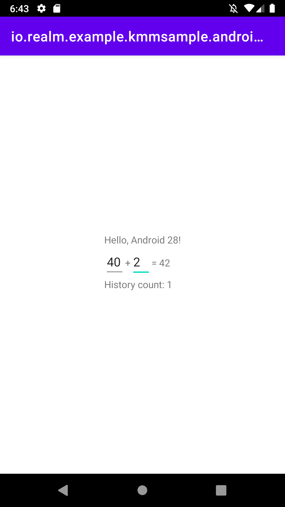
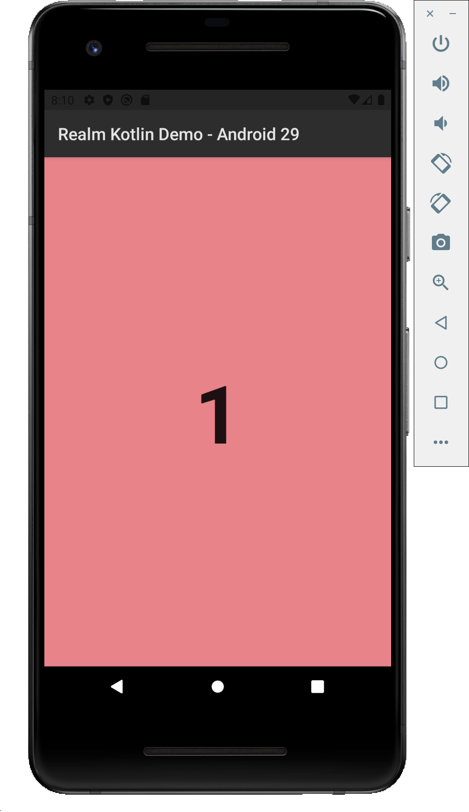
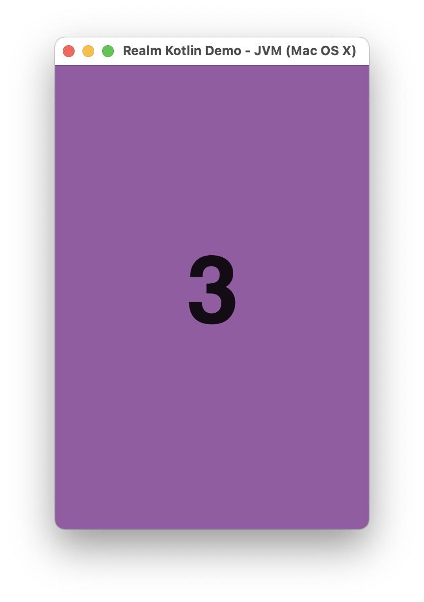
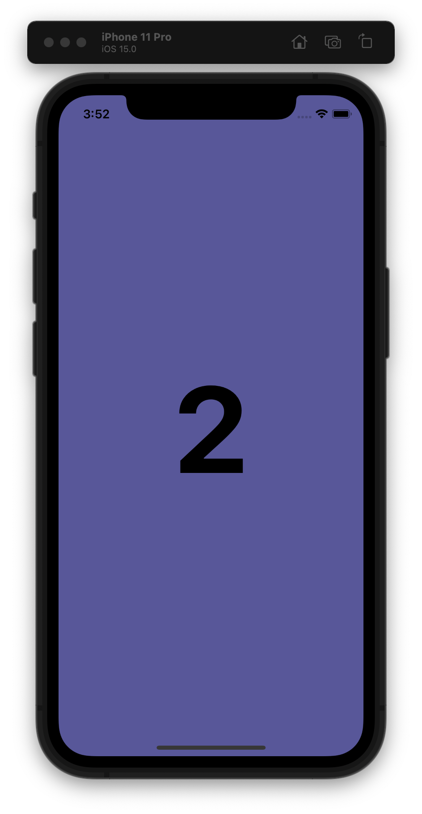
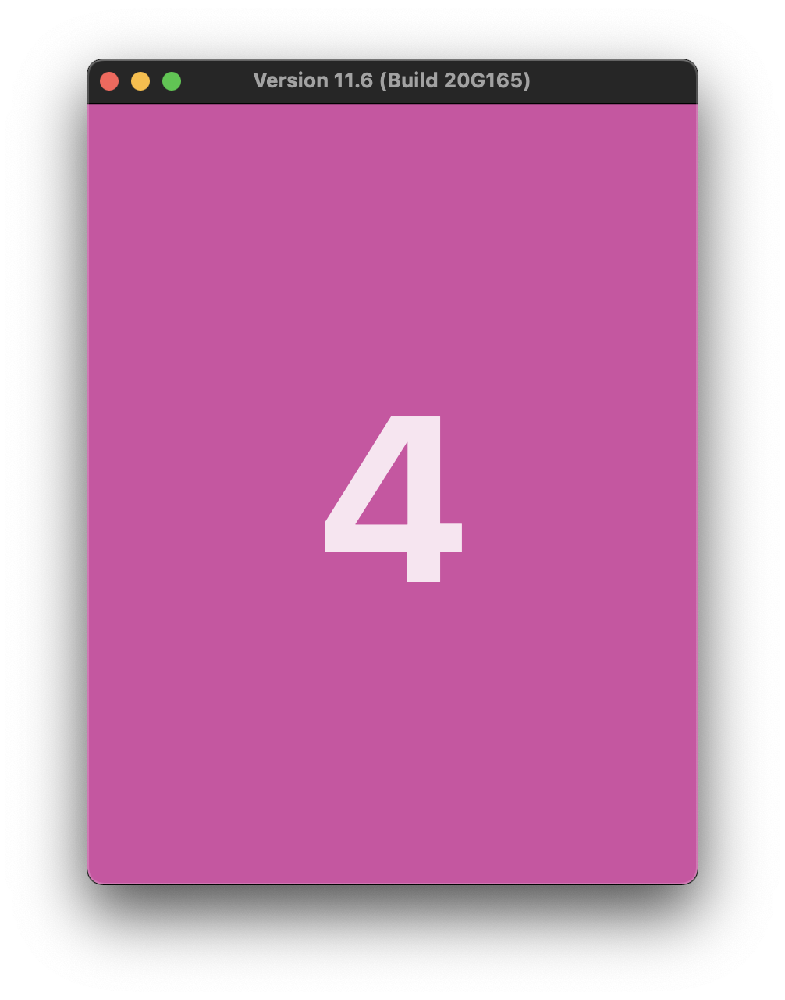
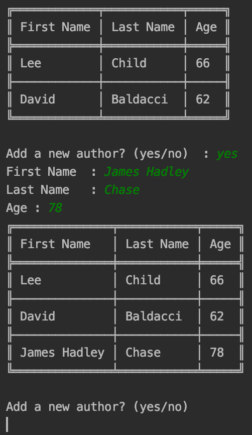

# Realm-Kotlin Samples

This repository contains a set of projects to help you learn about using [Realm-Kotlin](https://github.com/realm/realm-kotlin) SDK
Each sample demonstrates different use cases.

💻 Requirements
------------
To try out these sample apps, clone the repository then import each project as an existing Android Studio project.
Samples are based on Kotlin `1.6.10`.

🧬 Samples
------------

| Project  |   |   | 
|---|---|---|
| [Intro](./Intro):   This is a simple example based on the official [KMM Sample](https://github.com/Kotlin/kmm-sample/blob/master/README.md) |   |  |
| [Bookshelf](./Bookshelf):   A more elaborate example using a shared business logic in Ktor, Kotlinx.Serialization and Realm, combined with a platform specific UI using Jetpack Compose and SwiftUI |   |   |
| [Kotlin Multiplatform Demo](./MultiplatformDemo):   Kotlin Multiplatform demo running on Android/iOS/macOS and JVM with Compose Desktop. |   |   |
| [JVM Console Application](./JVMConsole):   Simple Java Console Application using Realm-Kotlin. |  

| External Project  |   |   |  |
|---|---|---|---|
| [FantasyPremierLeague](https://github.com/joreilly/FantasyPremierLeague):   Kotlin Multiplatform project with Jetpack Compose and SwiftUI by [@joreilly](https://github.com/joreilly/) |   |   |  |
